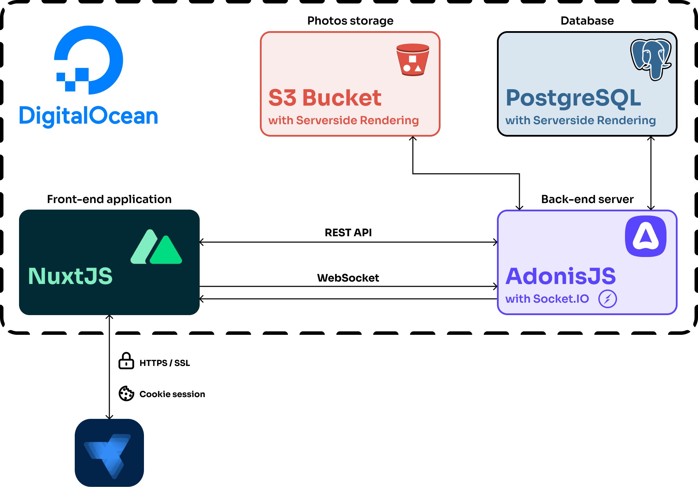
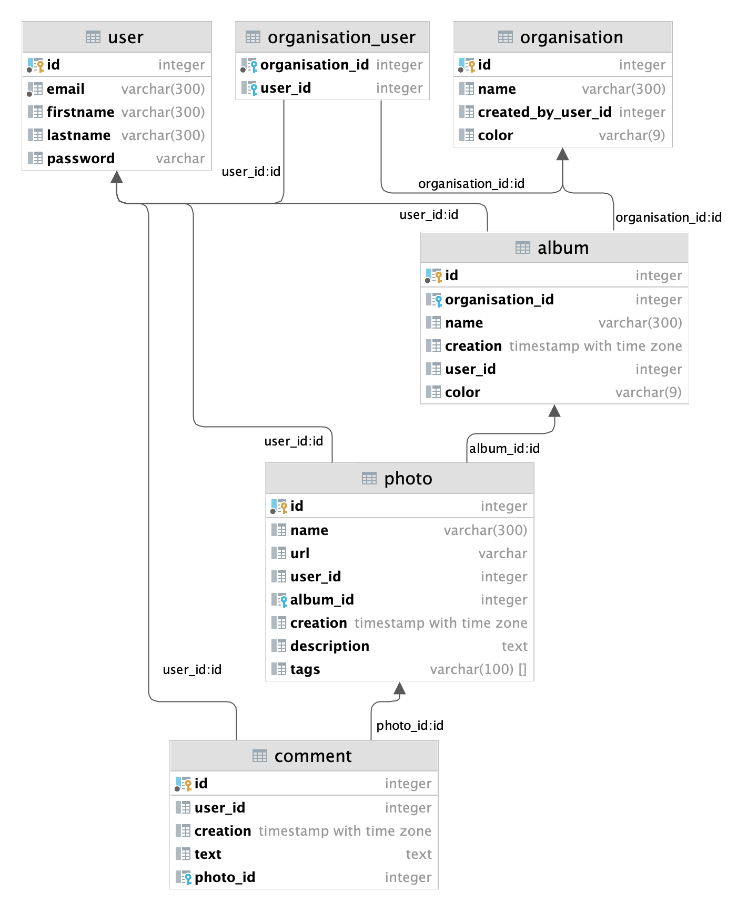
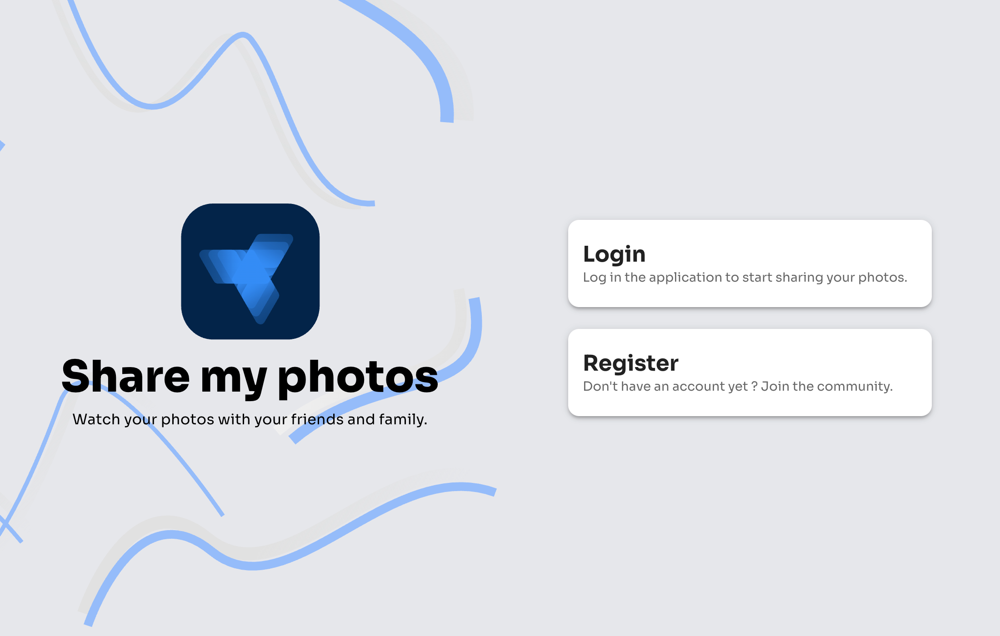
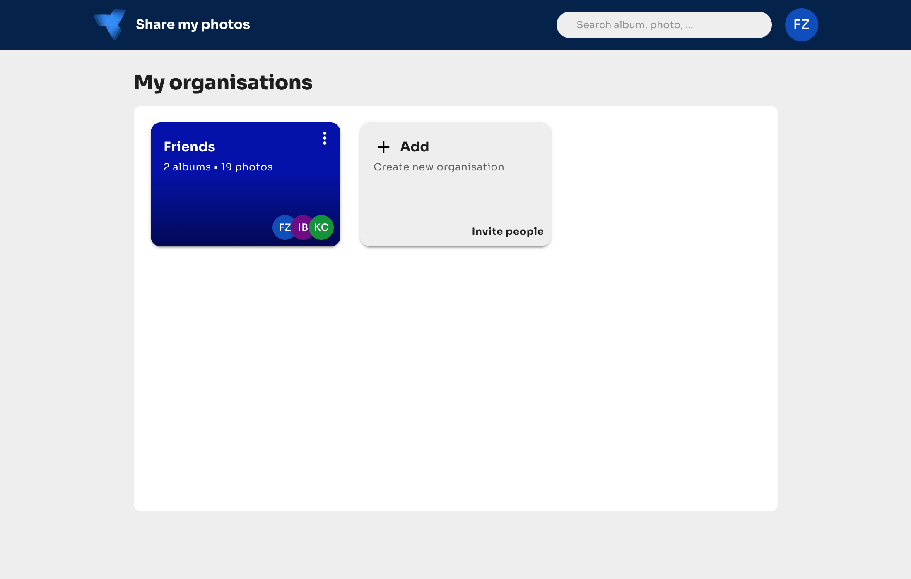
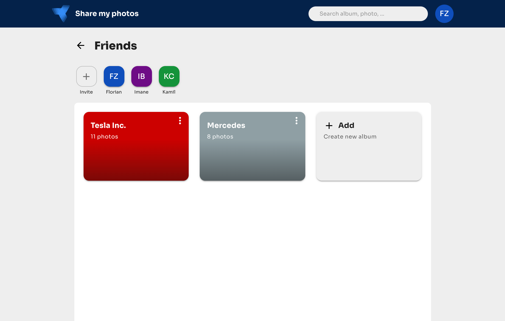
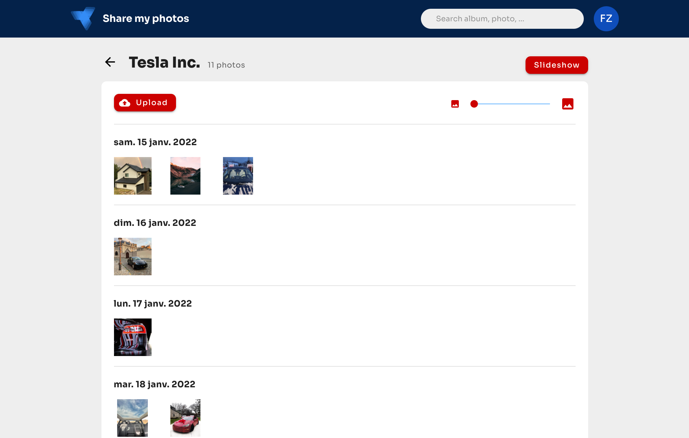
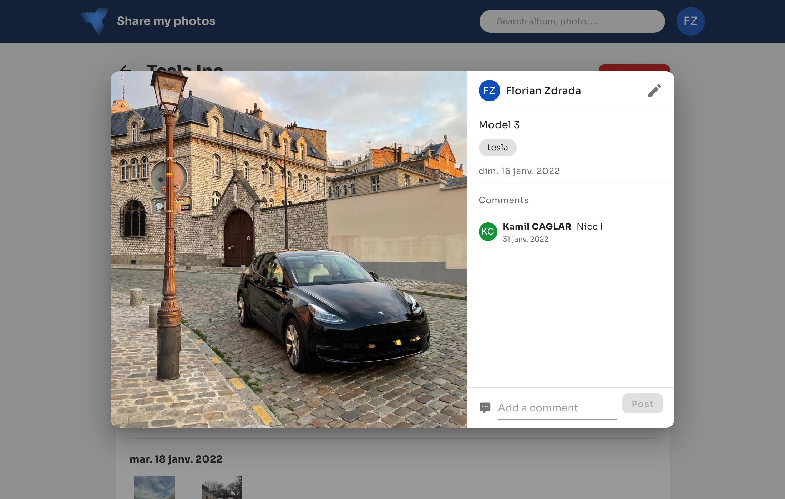
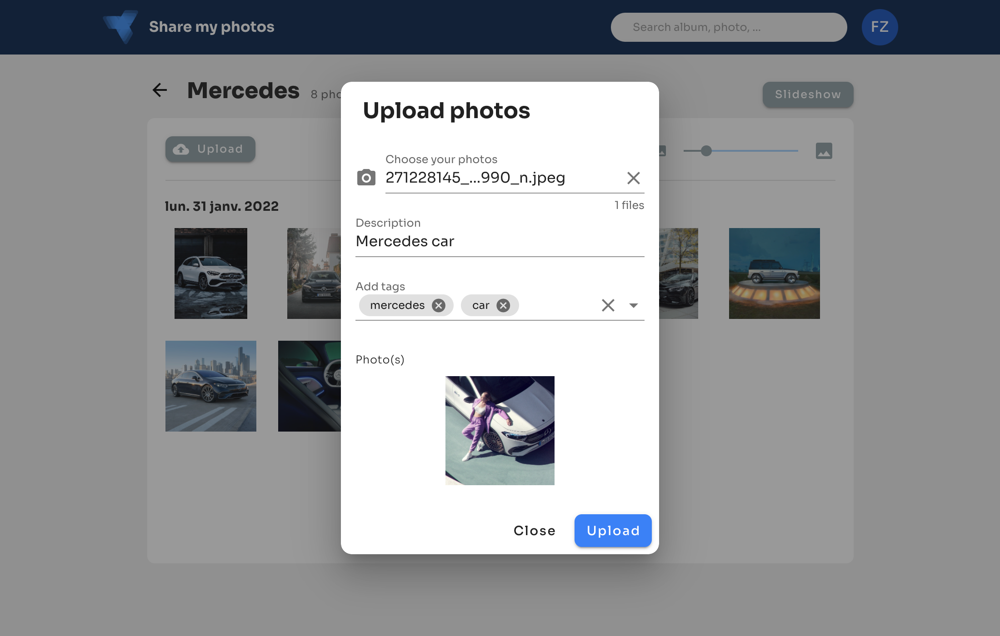
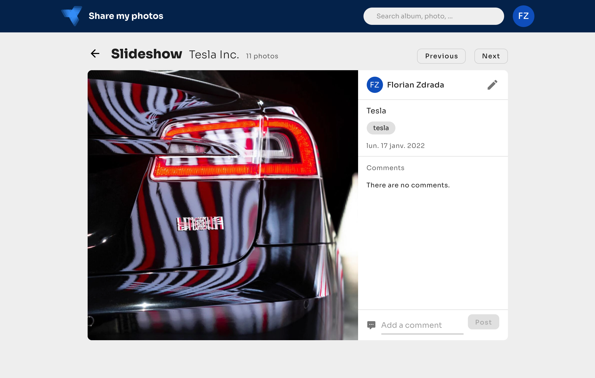

 

<h1 align="center">Share my photos</h1>

    A web application to publish your photos and create a real-time slideshow synchronized on multiple devices.
     
     
    <a href="https://youtu.be/BPS9QKqy3mQ">
        
                 
        
            View Demo on YouTube
        
    </a>

<!-- TABLE OF CONTENTS -->

  
Table of Contents

  <ol>
    <li>
      <a href="#about-the-project">About The Project</a>
      <ul>
        <li><a href="#required-specifications">Required specifications</a></li>
        <li><a href="#bonus-specifications">Bonus specifications</a></li>
      </ul>
    </li>
    <li>
      <a href="#built-with">Built with</a>
      <ul>
        <li><a href="#front-end">Front-end</a></li>
        <li><a href="#back-end">Back-end</a></li>
      </ul>
    </li>
    <li><a href="#architecture-diagram">Architecture diagram</a></li>
    <li><a href="#database-diagram">Database diagram</a></li>
    <li><a href="#screenshots">Screenshots</a></li>
    <li><a href="#contributing">Contributing</a></li>
    <li><a href="#license">License</a></li>
  </ol>

<!-- ABOUT THE PROJECT -->

# About The Project

This school project is made by [Florian Zdrada](https://github.com/flozdra) and [Kamil Caglar](https://github.com/kamilcglr).

## Required specifications

- Add one or multiple photos with a description
- Photo modification
- Photo deletion
- Real-time slideshow across multiple devices
- Search for photo

## Bonus specifications

- Register / login
- Organisations, albums (create, update, delete)
- Access managements to organisations
- Comments on photos
- Tags on photos
- Real-time comments on slideshow
- PWA application
- Auto-deployment on DigitalOcean from GitHub with high-availability and HTTPS

# Built With

## Front-end

### Client

- [Vue.js](https://vuejs.org/)
- [Nuxt.js](https://nuxtjs.org/)
- [Vuetify](https://vuetifyjs.com/en/)

## Back-end

### Server

- [AdonisJS](https://adonisjs.com/)
- [Socket.IO](https://socket.io/)

### Storage

- [PostgreSQL](https://www.postgresql.org/)
- [MinIO](https://min.io/)

### Deployment

- [Docker](https://www.docker.com/)
- [DigitalOcean](https://www.digitalocean.com/)

# Architecture diagram

# Database diagram

    

# Screenshots

# Contributing

Contributions are what make the open source community such an amazing place to learn, inspire, and create. Any contributions you make are **greatly appreciated**.

If you have a suggestion that would make this better, please fork the repo and create a pull request. You can also simply open an issue with the tag "enhancement".
Don't forget to give the project a star! Thanks again!

# License

Distributed under the MIT License.
